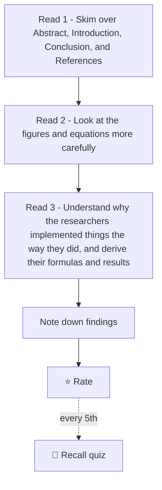

# Homebase

---

## Phases

Current phase: exploration

| Phase | What happens | Moves on when |  
|---|---|---|  
| 1. Exploration | One or two introductory or high-impact papers from each ML field, covering every field. Each paper is rated 1 to 5, and ratings are tracked by field to spot patterns. | A field gets 3 ratings of 4+ in a row, or 6 to 8 fields have been sampled |  
| 2. Topic progression | A dependency-ordered reading list for the winning topic. It starts with the foundational paper, and each paper after it builds on the last and gets harder in math and complexity. After each one, I should be able to explain what the earlier work struggled with and which decisions led to the improvement. | Ratings stay high for 3+ days. If ratings drop to 2 or lower two days in a row, I pivot to the next highest-rated topic from exploration |  
| 3. Task phase | Each paper gets a derivation check, a section-by-section quiz, and a written summary and critique. Every 3rd or 4th paper, I reproduce the core method or one experiment in code. Small Jupyter projects apply the concepts hands-on. | Final phase |

Every 5th paper is a mixed recall quiz covering all earlier papers in the progression.

---

## Paper Log

| Date      | Paper                                                            | Field                                |  Rating  | Note                                                                 |  
| --------- | ---------------------------------------------------------------- | ------------------------------------ | :------: | -------------------------------------------------------------------- |  
| 9/15/2026 | Attention is All You Need                                        | #nlp #transformer                    |   ⭐⭐⭐⭐   | [Attention Is All You Need](notes/attention-is-all-you-need.md)                                        |  
| 9/16/2026 | Deep Residual Learning for Image Recognition                     | #cv #resnet #deep-learning           |   ⭐⭐⭐⭐   | [Deep Residual Learning for Image Recognition](notes/deep-residual-learning-for-image-recognition.md)                     |  
| 9/21/2026 | Playing Atari with Deep Reinforcement Learning                   | #rl #dqn #deep-learning`             |    ⭐⭐    | [Playing Atari with Deep Reinforcement Learning](notes/playing-atari-with-deep-reinforcement-learning.md)                   |  
| 9/22/2026 | Generative Adversarial Networks                                  | #generative #gan #deep-learning      |  ⭐️⭐️⭐️  | [Generative Adversarial Networks](notes/generative-adversarial-networks.md)                                  |  
| 9/23/2026 | SEMI-SUPERVISED CLASSIFICATION WITH GRAPH CONVOLUTIONAL NETWORKS | #graph-ml #gcn #deep-learning        | ⭐️⭐️⭐️⭐️ | [SEMI-SUPERVISED CLASSIFICATION WITH GRAPH CONVOLUTIONAL NETWORKS](notes/semi-supervised-classification-with-graph-convolutional-networks.md) |  
| 9/24/2026 | Adam: A Method for Stochastic Optimization                       | #optimization #theory #deep-learning |   ⭐️⭐️   | [Adam - A Method for Stochastic Optimization](notes/adam-a-method-for-stochastic-optimization.md)                      |  
| 9/27/2026 | RT-1: Robotics Transformer for Real-World Control at Scale       | #robotics #transformer #embodied-ai  |          | [RT-1 Robotics Transformer for Real-World Control at Scale](notes/rt-1-robotics-transformer-for-real-world-control-at-scale.md)        |

---

## Active Progression

1. [Attention Is All You Need](notes/attention-is-all-you-need.md)  
2. [Deep Residual Learning for Image Recognition](notes/deep-residual-learning-for-image-recognition.md)  
3. [Playing Atari with Deep Reinforcement Learning](notes/playing-atari-with-deep-reinforcement-learning.md)  
4. [Generative Adversarial Networks](notes/generative-adversarial-networks.md)  
5. [SEMI-SUPERVISED CLASSIFICATION WITH GRAPH CONVOLUTIONAL NETWORKS](notes/semi-supervised-classification-with-graph-convolutional-networks.md)  
6. Adam: A Method for Stochastic Optimization  
7. [RT-1 Robotics Transformer for Real-World Control at Scale](notes/rt-1-robotics-transformer-for-real-world-control-at-scale.md)

---  
## Papers for Later

Q-learning: https://henriquetmaia.github.io/pdf/papers/watkins1992.pdf 

## Tags

#rl #dqn #deep-learning #cv #resnet #nlp #transformer #generative #gan #graph-ml #gcn
