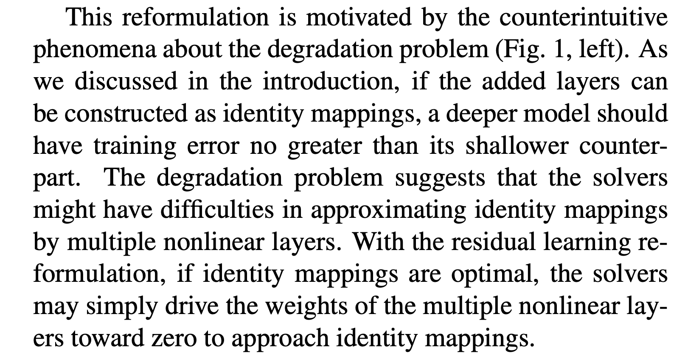
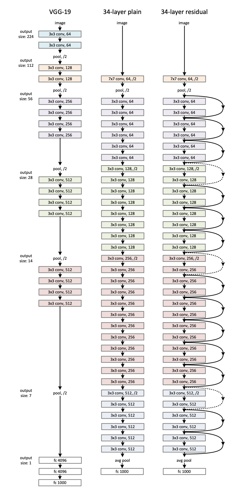

# Deep Residual Learning for Image Recognition

**Date**: 09-16-2026 • [Homebase](../README.md) • #cv #resnet #deep-learning`

**Link:** https://arxiv.org/abs/1512.03385

### TL;DR:   
Previously, deep neural networks were difficult to train, so the research team developed a residual learning framework that contains layers of residual functions that reference layer inputs rather than purely unreferenced functions.

### Problem:   
The research team questioned: "Is learning better networks as easy as stacking more layers?"

The issue that they faced is that when additional layers were added to a sufficiently deep model, training accuracy began to decrease, instead of the model actually overfitting on training data.

### Key equations/terms:   
- Identity mapping: 

### Design choices + why:   
- Chose to use a residual mapping instead of unreferenced or identity

### Results:   
1) Our extremely deep residual nets are easy to optimize, but the counterpart “plain” nets (that simply stack layers) exhibit higher training error when the depth increases;   
2) Our deep residual nets can easily enjoy accuracy gains from greatly increased depth, producing results substantially better than previous networks.

### Open questions:   
- I still don't understand the idea of shortcut connections and identity shortcuts

**Builds on:** None  
**Rating:** ⭐️⭐️⭐️⭐️

---  
#### Notes for myself:

What does "reformulate the layers as learning residual functions with reference to the layer inputs, instead of learning unreferenced functions" mean?

**What is "vanishing/exploding gradients"?**  
- The gradient values that update weights during backpropagation are calculated as a product of several terms that may be less than 1. As a result, the product will become negligible and won't update the weights

**Deep CNNs:** CNNs with many convolution layers  
- The purpose of deeper and deeper CNNs is to enrich the features that can be detected

**What is stochastic gradient descent?**  
- Taking a randomly-selected batch of input nodes to do gradient descent on --> speeds up calculations

**What is mapping:** how the neural network takes in inputs and produces outputs  
- **Unreferenced mapping:** a mapping where the layers attempt to produce a function `H(x)` directly from `x`  
- **Identity mapping:** H(x) = x  
- **Residual mapping:** the difference between the desired output and the input where F(x) := H(x) − x

**Key paragraph for motivation of methodology:**  

**Shortcut connection:** direct connection from a block's input to a point later in the network, skipping over stacked layers

**Illustration of the shortcut connection applied to the plain nn:**

